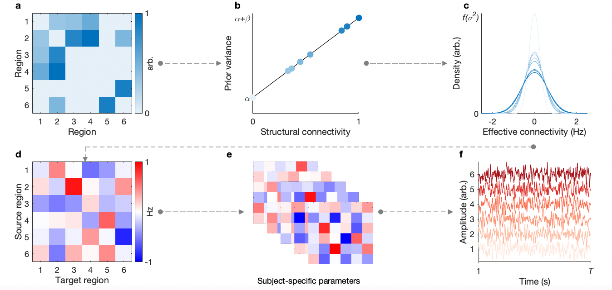

# Hierarchical Empirical Bayes Model

Code and derived data for implementing the hierarchical empirical Bayes model of effective connectivity described in [Greaves et al. (2024)](https://doi.org/10.1101/2024.04.03.587831).

## Overview

This repository includes the core model implementation, simulation workflows, a scoped permutation-based control analysis (see below), and materials needed to reproduce the main results figures. The code can be used either to reproduce the analyses reported in the manuscript or to apply the framework to an existing set of inverted dynamic causal models (DCMs).

<br>

<p align="center">
  
</p>

Conceptual overview of the hierarchical empirical Bayes model. Structural connectivity is mapped onto connection-specific prior variances via a linear function with intercept α and slope β (*a*–*b*), yielding a structure-based prior over group-level effective connectivity (*c*). Subject-specific effective connectivity is then modeled as a noisy deviation from the group-level profile (*d*–*e*). When embedded within DCM, these subject-level parameters give rise to predicted blood-oxygen-level-dependent (BOLD) signals (shown for a single subject, *f*).

## Repository Structure

```text
.
├── core/            % Core hierarchical empirical Bayes functions
├── sim/             % Code for reproducing in silico analyses
├── perm/            % Permutation-based analyses
├── viz/             % Derived data and scripts for reproducing result visualizations
├── heb_sim_run.m    % Top-level script for running the simulation workflow
└── README.md

```

## Prerequisites

Code in this repository requires:
- MATLAB R2024a (or later)
- Statistical Parametric Mapping (SPM12) toolbox (see [here](https://github.com/spm/spm12))
- Variational Bayesian Analysis (VBA) toolbox (for random-effects Bayesian model comparison; see [here](https://mbb-team.github.io/VBA-toolbox/))
- Parallel Computing Toolbox (recommended for efficient execution; see [here](https://au.mathworks.com/help/parallel-computing/index.html))

## Running Simulations

To reproduce the simulations presented in the associated publication, download the full directory structure and execute the following:

```matlab
% Run simulations
heb_sim_run();
```

This function executes `heb_sim` (see `/sim` directory) across a predefined set of signal-to-noise ratio (SNR) levels. The analysis involves the following:
1. Simulating ground-truth effective connectivity at both the group and subject levels, followed by the generation of downstream BOLD signals.
2. Performing parameter recovery via:
   - The hierarchical empirical Bayes model.
   - A structurally informed multivariate autoregressive model (see Tanner et al., 2024, [here](https://doi.org/10.1038/s41467-024-50248-6)).

The figures generated are consistent with those presented in the main text (Fig. 2) and Supporting Information (Fig. S1).

**Note on Computation Time:** Running the simulation-based analysis for each SNR level takes approximately 14 minutes on a local machine when parallel computing is enabled. This estimate is based on MATLAB R2024a running on macOS (Darwin 21.6.0) with an 8-core Quartz CPU. The system was configured with Java 1.8.0_392-b08, utilising Amazon’s OpenJDK 64-Bit Server VM. Execution utilized `parpool` with 8 workers, allowing parallelized computations.

## Example Workflow with Data

To apply the hierarchical empirical Bayes approach to an existing dataset, it is recommended that the following requirements be met:

- DCMs inverted under identical prior assumptions, modeling an effective connectivity network with *n* > 2 regions. Per the procedures in the associated study, the prior variance for intraregional connections is fixed at 1/64, while the prior variance for interregional connections is 1/2 (see the first *n* diagonal elements of `DCM.M.pC`). This constraint can be modified by bypassing the relevant `assert` commands.
- A normalized [0,1] structural connectivity matrix (`C`) (or another relevant matrix) matching the dimensions of the `A` (transition) matrices, such that `C(i,j)` corresponds to `DCM.M.pE.A(i,j)`.

### **1. Explore hierarchical empirical Bayes models in a test sample**
- Store the inverted *test* DCMs in a cell array `P` and the structural connectivity in `C`.

#### Example:
```matlab
% Network name
network = 'DMN';

% Directory containing test subjects
test_dir = fullfile(pwd, 'test_subjects');

% Load DCMs
DCM_filelist = dir(fullfile(test_dir, '**', sprintf('*DCM_%s.mat', network)));

% Store loaded DCMs in cell array P
P = cellfun(@(f) load(fullfile(f.folder, f.name), 'DCM').DCM,...
 num2cell(DCM_filelist), 'UniformOutput', false);

% Load structural connectivity matrix
C = load(fullfile(test_dir, dir(fullfile(test_dir, '*SC.mat')).name)).SC;

% Run hierarchical empirical Bayes study
heb_study(P, C, network);
```

### **2. Assess the consistency of Bayesian model average (BMA) data-to-variance mapping**
- Repeat the steps above for the *holdout* sample. Store holdout DCMs in `Pv` and structural connectivity in `Cv`.
- Store the path to the `HEB` file saved during the previous step.

#### Example:
```matlab
% Store the path to the 'HEB' file saved in the previous step
HEB = fullfile(pwd, sprintf('HEB_explore_%s.mat', network));

% Validate Bayesian model average (BMA) data-to-variance mapping
heb_study(Pv, Cv, network, HEB);
```

## Reproducibility Resources

### Figure Reproducibility

All main-text figures except one schematic artwork (Fig. 1) are reproducible from code in this repository. Fig. 2 is generated via the simulation scripts (orchestrated by `heb_sim_run`, with figure generation in `sim/heb_sim_fig.m`), while Figs. 3-5 and Supporting Information Figs. S3-S4 are reproduced from compact derived data in `viz/` using `heb_bf_figs.m` and `heb_brain_fig.m`.

### Permutation-Based Analyses

This repository includes resources for reproducing the permutation-based analyses reported in the Supporting Information. The full-pipeline permutation null under scrambled structural connectivity is reproduced from derived data using `perm/heb_perm_pipeline_null_fig.m` and `perm/plperm/perm_si_figure_data_B1000.mat` (Supporting Information Fig. S5). These derived data contain the network-wise outputs from 1000 full-pipeline permutations for each of the 17 networks. The companion template `perm/heb_perm_pipeline_null_pseudo.m` documents the corresponding analysis workflow for users with their own first-level DCMs and matched structural-connectivity matrices.

The complete raw inputs needed to rerun the full 17-network analysis end-to-end (full HEB/DCM structures) are too large to distribute here. To keep the repository lightweight while enabling reproducibility, `perm/` also includes a scoped demonstration of the conditioned permutation/model-comparison analysis used to test whether first-level evidence gains are specific to a structure-based second-level prior, rather than generic shrinkage. This demonstration runs the same procedure on the first (*Control A*) network using compact real-data derivatives: `heb_perm_bmr_rfx_bmc_toy.m` reruns the permutation/model-comparison workflow, and `heb_perm_bmr_rfx_bmc_fig.m` regenerates the associated Supporting Information Fig. S6. Here, “toy” refers to reduced scope (one network), not synthetic data.

## **Flexibility and Interpretation**
The code in this repository can be easily modified to explore different data-to-prior-variance mappings, allowing for hypothesis testing regarding the relationship between structural and effective connectivity.  

The outputs of `heb_study` are straightforward to interpret for researchers familiar with dynamic causal modeling or other models estimated using SPM's nonlinear system identification framework. This approach can address a range of research questions related to structural–function relationships.

## **Contact**
Questions? Please feel free to reach out.

## **Reference**
Greaves et al. (2024). *Structurally informed resting-state effective connectivity recapitulates cortical hierarchy.*  
DOI: [https://doi.org/10.1101/2024.04.03.587831](https://doi.org/10.1101/2024.04.03.587831)
